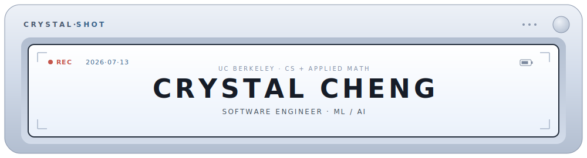

  

`● REC   2026·07·13   ▮▮▮▮ on-device`

i build privacy-first AI, small enough to run on your phone instead of a server. cs and applied math at uc berkeley, currently at hyve solutions. this is the technical cut of my [portfolio](https://chengjcrystal.vercel.app).

## ⌜ projects ⌟

| shot | what it is |
| --- | --- |
| **freshcheck** | ~24k-param CNN, 97.7% held-out accuracy, runs fully in-browser (ONNX / WASM) |
| **mbti guesser** | zero-shot BART-MNLI over text, image + numeric signals |
| **reporank** | hand-built inverted index + BM25, blended re-ranker, nDCG@10 0.98 |

## ⌜ stack ⌟

`python` `pytorch` `onnx` `hf transformers` `fastapi` `react`
`aws` `terraform` `dynamodb` `docker` `sql`

## ⌜ live ⌟

- ◉ freshcheck: [freshcheckfruit.vercel.app](https://freshcheckfruit.vercel.app/)
- ◉ mbti guesser: [huggingface.co/spaces/chengjcrystal/mbti-guesser](https://huggingface.co/spaces/chengjcrystal/mbti-guesser)
- ▸ reporank: [github.com/chengjcrystal/reporank](https://github.com/chengjcrystal/reporank)
- @ email: [cjcheng@berkeley.edu](mailto:cjcheng@berkeley.edu)
