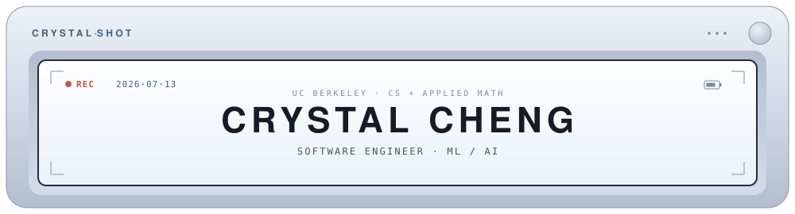

  

`● REC   ▮▮▮▮ on-device`

i build privacy-first AI, small enough to run on your phone instead of a server. cs and applied math at uc berkeley, most recently at hyve solutions. this is the technical cut of my [portfolio](https://chengjcrystal.vercel.app).

## ⌜ projects ⌟

| shot | what it is |
| --- | --- |
| **reporank** | search engine over 157k real github repos, ranking built from scratch instead of elasticsearch |
| **freshcheck** | tells you if a fruit is fresh from a photo, runs fully in your browser, no server |
| **mbti radar** | reads your mbti type from scenarios you write, a photo, and social stats with no training data, then deals it back as a card pack to open |

## ⌜ stack ⌟

`python` `pytorch` `onnx` `hf transformers` `fastapi` `react`
`aws` `terraform` `dynamodb` `docker` `sql`

## ⌜ live ⌟

- ◉ reporank: [reporank-jgoo.onrender.com](https://reporank-jgoo.onrender.com)
- ◉ freshcheck: [freshcheckfruit.vercel.app](https://freshcheckfruit.vercel.app/)
- ◉ mbti radar: [huggingface.co/spaces/chengjcrystal/mbti-radar](https://huggingface.co/spaces/chengjcrystal/mbti-radar)
- @ email: [chengjcrystal@gmail.com](mailto:chengjcrystal@gmail.com)
